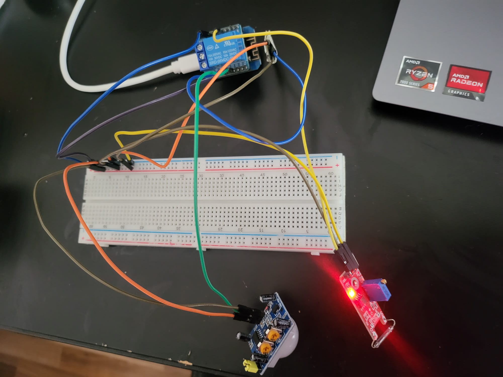
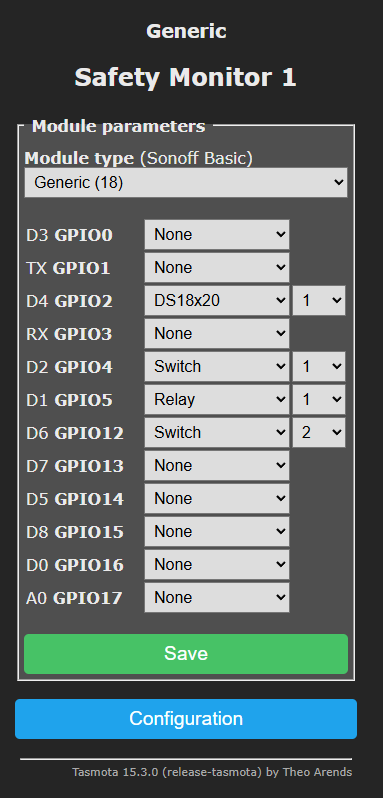
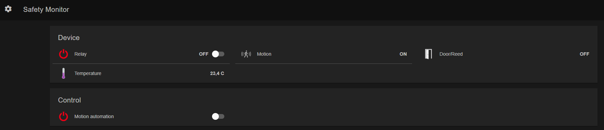

# Project Evidence

Paste screenshots and photos directly below each heading.

Tip: after pasting an image, keep the short caption below it. The captions can be reused in the final report.

## 1. Monitoring Node Wiring



Figure 1 shows ESP #1, the monitoring node, connected to the PIR sensor, reed switch module, DS18B20 temperature sensor, the existing relay output on D1, and shared 3.3V/GND breadboard rails.

Status:

```text
Captured: yes
```

## 2. Monitoring Node Tasmota Module Configuration



Figure 2 shows the Tasmota GPIO configuration for ESP #1:

```text
D2 / GPIO4  -> Switch1, PIR motion sensor
D4 / GPIO2  -> DS18x20 temperature sensor
D6 / GPIO12 -> Switch2, reed switch
D1 / GPIO5  -> Relay1, existing test relay
```

Status:

```text
Captured: yes
```

## 3. Tasmota Console: PIR And Reed Events


Figure 3 shows the Tasmota console publishing `Switch1` events from the PIR sensor and `Switch2` events from the reed switch.

Status:

```text
Captured: yes
```

## 4. MQTT Explorer: Switch Events


Figure 4 shows MQTT Explorer receiving switch events from the monitoring node under:

```text
stat/safety_monitor_1/RESULT
```

This proves that the sensor node publishes PIR and reed events to the MQTT broker.

Status:

```text
Captured: yes
```

## 5. MQTT Explorer: Temperature Sensor


Figure 5 shows MQTT Explorer receiving DS18B20 temperature telemetry under:

```text
tele/safety_monitor_1/SENSOR
```

This proves that the monitoring node also publishes periodic sensor telemetry.

Status:

```text
Captured: yes
```

## 6. openHAB Basic UI: Current Safety-Monitoring View



Figure 6 shows the current openHAB Basic UI with the relay and motion items for the safety-monitoring project.

Status:

```text
Captured: no
```

## 7. Alarm Node Wiring

Paste image here.

Figure 7 shows ESP #2, the alarm node, connected to its relay and/or buzzer actuator.

Status:

```text
Captured: no
```

## 8. Alarm Node Tasmota Module Configuration

Paste image here.

Figure 8 shows the Tasmota GPIO configuration for ESP #2, the alarm actuator node.

Status:

```text
Captured: no
```

## 9. Device 1 Triggers Device 2

Paste image here.

Figure 9 shows the final distributed automation: an event from ESP #1 is received by openHAB and causes an actuator output on ESP #2.

Status:

```text
Captured: no
```

## Evidence Chain

The final proof chain for the project is:

```text
PIR/reed sensor
  -> Tasmota on ESP #1
  -> MQTT broker
  -> openHAB item/rule
  -> MQTT command
  -> Tasmota on ESP #2
  -> relay/buzzer actuator
```
