# Project Evidence

Paste screenshots and photos directly below each heading.

Tip: after pasting an image, keep the short caption below it. The captions can be reused in the final report.

## 1. Monitoring Node Wiring

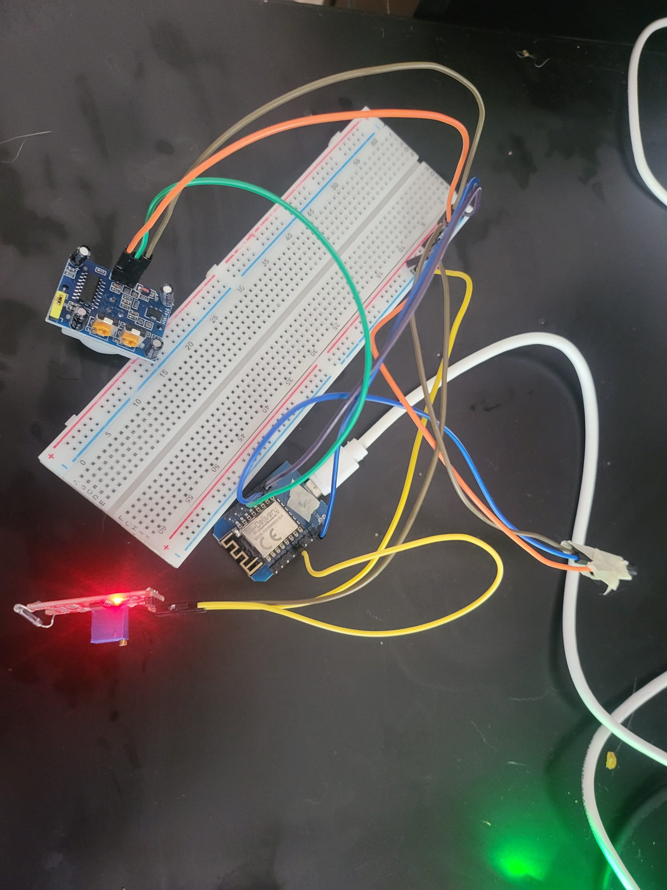

Figure 1 shows ESP #1, the monitoring node, connected to the PIR sensor, reed switch module, DS18B20 temperature sensor, and shared 3.3V/GND breadboard rails.

## 2. Monitoring Node Tasmota Module Configuration

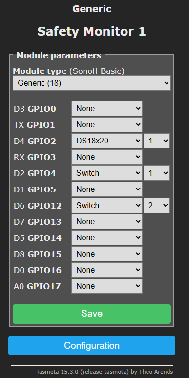
Figure 2 shows the Tasmota GPIO configuration for ESP #1:

```text
D2 / GPIO4  -> Switch1, PIR motion sensor
D4 / GPIO2  -> DS18x20 temperature sensor
D6 / GPIO12 -> Switch2, reed switch
```

## 3. Tasmota Console: PIR And Reed Events

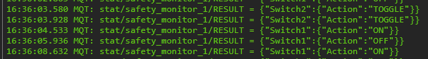

Figure 3 shows the Tasmota console publishing `Switch1` events from the PIR sensor and `Switch2` events from the reed switch.

## 4. MQTT Explorer: Switch Events

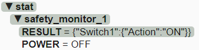

Figure 4 shows MQTT Explorer receiving switch events from the monitoring node under:

```text
stat/safety_monitor_1/RESULT
```

This proves that the sensor node publishes PIR and reed events to the MQTT broker.

## 5. MQTT Explorer: Temperature Sensor

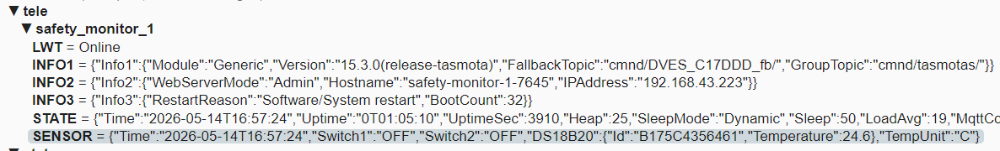

Figure 5 shows MQTT Explorer receiving DS18B20 temperature telemetry under:

```text
tele/safety_monitor_1/SENSOR
```

This proves that the monitoring node also publishes periodic sensor telemetry.

## 6. Alarm Node Wiring

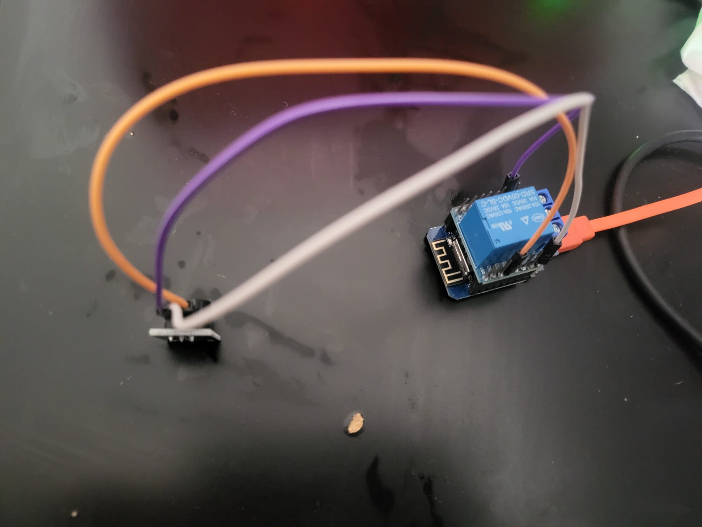

Figure 6 shows ESP #2, the alarm node, connected to the relay and PWM buzzer actuator.

## 7. Alarm Node Tasmota Module Configuration

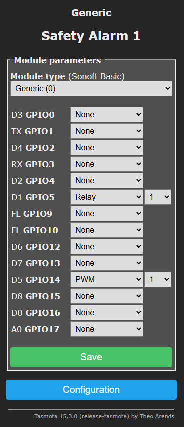

Figure 7 shows the Tasmota GPIO configuration for ESP #2:

```text
D1 / GPIO5  -> Relay1
D5 / GPIO14 -> PWM1 buzzer
Topic       -> safety_alarm_1
```

## 8. Safety Context Node Wiring

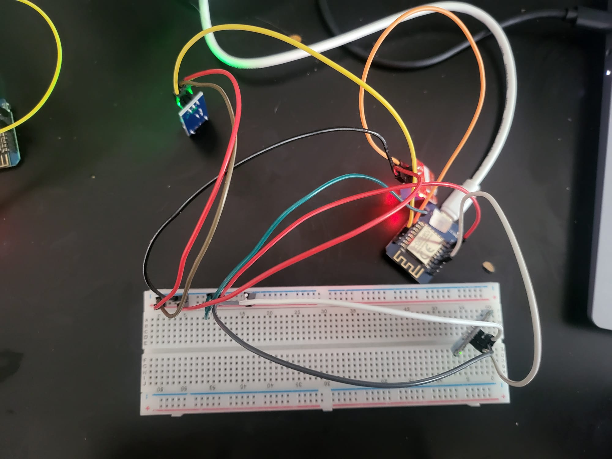

Figure 8 shows ESP #3, the safety context node, connected to the vibration sensor, microphone module, and touch sensor.

## 9. Safety Context Node Tasmota Module Configuration

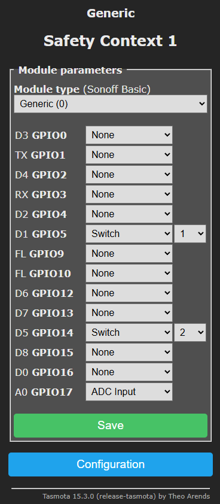
Figure 9 shows the Tasmota GPIO configuration for ESP #3:

```text
D1 / GPIO5 -> Switch1, vibration sensor
D2 / GPIO4 -> None
D5 / GPIO14 -> Switch2, touch / acknowledge sensor
A0 / GPIO17 -> ADC Input / Analog, microphone AO
Topic      -> safety_context_1
```

## 10. MQTT Explorer: Context Sensor Events And Telemetry

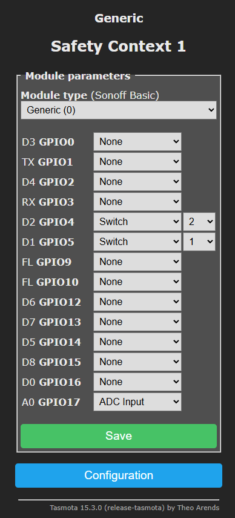

Figure 10 shows MQTT Explorer receiving context-node sensor events and analog microphone telemetry under:

```text
stat/safety_context_1/RESULT
tele/safety_context_1/SENSOR
```

Current observation:

```text
tele/safety_context_1/SENSOR includes Switch1, Switch2, and ANALOG.A0
SetOption114 1 detached the context-node switches from generic POWER behavior
SwitchMode1 1 and SwitchMode2 1 were applied
vibration sensor now publishes clean Switch1 ON/OFF action messages
touch sensor now publishes clean Switch2 ON/OFF action messages
microphone is available as analog A0 telemetry
```

This proves the context node is online, the vibration and touch inputs publish clean MQTT switch events, and the microphone analog value is visible in telemetry.

## 11. openHAB Basic UI: Current Safety-Monitoring View

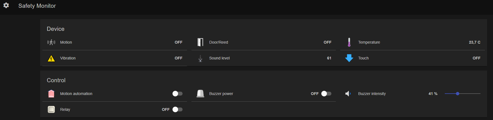

Figure 11 shows the current openHAB Basic UI with all three distributed nodes integrated:

```text
ESP #1 -> motion, door/reed, temperature
ESP #2 -> relay, buzzer power, buzzer intensity
ESP #3 -> vibration, sound level, touch acknowledgement
```

## 12. Combined Sensor Events Trigger The Alarm Node

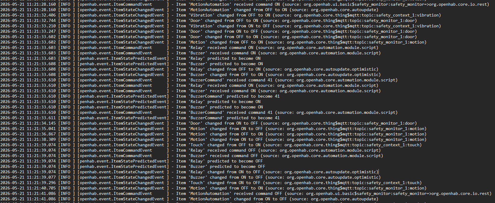

Figure 12 shows the distributed automation in `events.log`:

```text
1. MotionAutomation is switched ON in the openHAB UI.
2. Vibration from ESP #3 is received by openHAB.
3. Door/reed and motion from ESP #1 are received by openHAB.
4. openHAB rule sends ON commands to the relay and buzzer on ESP #2.
5. BuzzerCommand sends the configured buzzer intensity value.
6. Touch from ESP #3 is received as acknowledgement.
7. openHAB rule sends OFF commands to the relay and buzzer on ESP #2.
8. MotionAutomation is switched OFF again.
```

This proves the complete path from distributed sensor events through openHAB rule logic to actuator commands on the alarm node.

## 13. MQTT Explorer: Runtime Topics For All Nodes

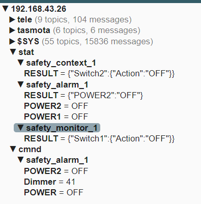

Figure 13 shows live MQTT topics for all three distributed nodes:

```text
stat/safety_monitor_1/RESULT  -> monitoring-node sensor events
stat/safety_context_1/RESULT  -> context-node touch/vibration events
stat/safety_alarm_1/POWER1    -> alarm-node relay state
stat/safety_alarm_1/POWER2    -> alarm-node buzzer state
cmnd/safety_alarm_1/POWER     -> relay command sent through MQTT
cmnd/safety_alarm_1/POWER2    -> buzzer command sent through MQTT
cmnd/safety_alarm_1/Dimmer    -> buzzer intensity command sent through MQTT
```

This proves that Mosquitto is the communication layer between the distributed Tasmota nodes and openHAB. The monitoring and context nodes publish events, while the alarm node receives actuator commands.

## 14. HTTP Binding: External Safety Context

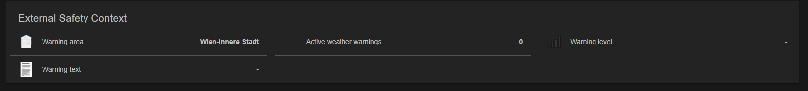

Figure 14 shows openHAB reading official GeoSphere Austria warning data through the HTTP binding.

The current warning area is:

```text
Wien-Innere Stadt
```

The active warning count is currently `0`, so there is no warning level or warning text shown. This is the expected state when GeoSphere Austria has no active warning for the selected coordinates.

This proves that the project uses both communication paths required for the safety-monitoring system:

```text
MQTT -> local distributed IoT nodes
HTTP -> external official safety context
```

## 15. Network Plan

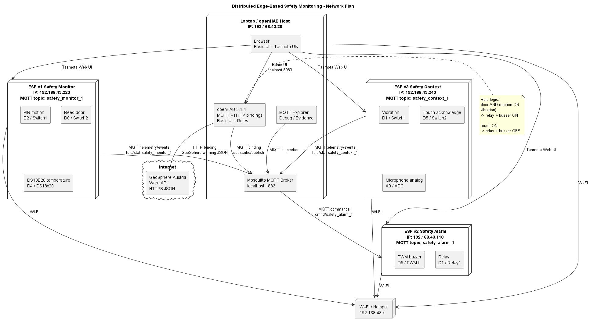

The network plan is documented as PlantUML in:

```text
docs/network-plan.puml
```

It shows:

```text
ESP #1 Safety Monitor  -> Wi-Fi -> Mosquitto -> openHAB
ESP #3 Safety Context  -> Wi-Fi -> Mosquitto -> openHAB
openHAB rules          -> Mosquitto -> ESP #2 Safety Alarm
GeoSphere Austria API  -> HTTP binding -> openHAB
MQTT Explorer          -> Mosquitto for debugging/evidence
Browser                -> openHAB Basic UI and Tasmota web UIs
```

## 16. openHAB Basic UI: Node Availability Online

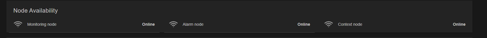

Figure 16 should show that openHAB receives and displays MQTT Last Will and Testament values for all distributed Tasmota nodes.

## 17. openHAB Basic UI: Node Availability Offline Test

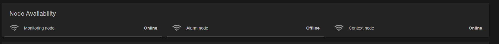

Figure 17 should show that the MQTT broker publishes the LWT `Offline` state when a node disappears and openHAB displays the changed availability state.

## 18. openHAB Basic UI: Risk Score And Alarm State

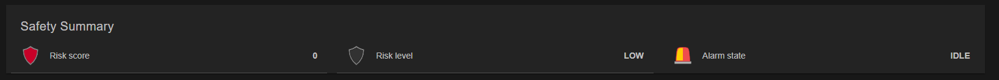

Figure 18 shows that openHAB calculates and displays a local risk score from distributed sensor context.

## 19. events.log: Risk Level Triggers Alarm

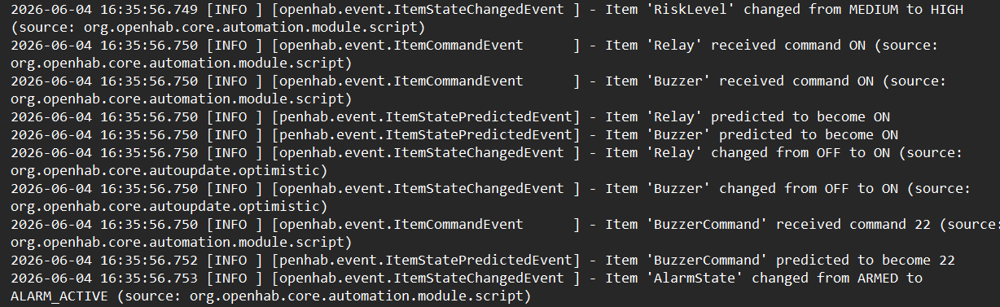

Figure 19 proves that the alarm is now triggered by calculated risk state, not only by one hard-coded sensor pair.

The log shows `RiskLevel` changing to `HIGH`, openHAB sending `ON` commands to `Relay` and `Buzzer`, and `AlarmState` changing to `ALARM_ACTIVE`.

## 20. events.log: Touch Acknowledges Alarm

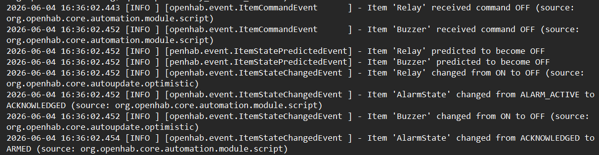

Figure 20 shows the touch acknowledgement flow. openHAB sends `OFF` commands to `Relay` and `Buzzer`, `AlarmState` changes to `ACKNOWLEDGED`, and then returns to `ARMED` after the risk/alarm-state rule recalculates.

## Evidence Chain

The final proof chain for the recorded demo is:

```text
1. openHAB automation is enabled from the Basic UI
2. Node availability is shown through MQTT LWT status Items
3. Vibration event is published by ESP #3 / Safety Context 1
4. Door/reed and PIR motion events are published by ESP #1 / Safety Monitor 1
5. Mosquitto forwards the MQTT events to openHAB
6. openHAB recalculates RiskScore and RiskLevel from distributed sensor evidence
7. RiskLevel HIGH or CRITICAL triggers MQTT commands to ESP #2 / Safety Alarm 1
8. ESP #2 switches the relay and buzzer actuator
9. Touch event from ESP #3 acknowledges the alarm
10. openHAB sends MQTT OFF commands to ESP #2
11. openHAB automation is disabled from the Basic UI
```

The external safety-context proof chain is:

```text
GeoSphere Austria Warn API
  -> openHAB HTTP binding
  -> GeoSphere warning Items
  -> Basic UI External Safety Context frame
```
